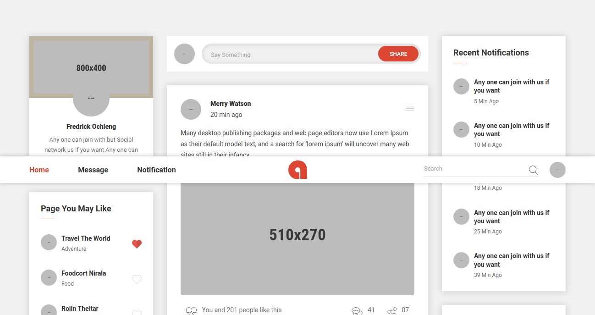

# adda Social Site Template
Adda  is a social app



One Paragraph of project description goes here

## Getting Started
Clone the repository to have it working in your local directory.

### Prerequisites

The files are ready to be viewed in a browser after cloning or downloading.

```

```

### Installing

A step by step series of examples that tell you how to get a development env running
```
finished
```
LIVE DEMO 
[Live Demo](http://femar.great-site.net/adda)

## Running the tests
No Tests
## Deployment

Fork This repo to Use it

## Built With

* [sass](https://sass-lang.com//) - Added For styles
* [Framework Y](http://framework-y.com/) - Framework
* [Adobe XD](https://www.adobe.com/products/xd.html) - Used to generate UI Layout
* Progressive development is ongoing.


## Authors

* **Fredrick Femar Ochieng** - *Initial work* - [Femar](https://github.com/fescii)
* **Moreh Wa Chege** - *Progressive Development* - [morehwachege](https://github.com/morehwachege)


## License

This project is licensed under the GNU General License - see the [LICENSE.md](LICENSE.md) file for details

## Acknowledgments
* 
[© aduki, Inc 2021](http://www.aduki.net)
